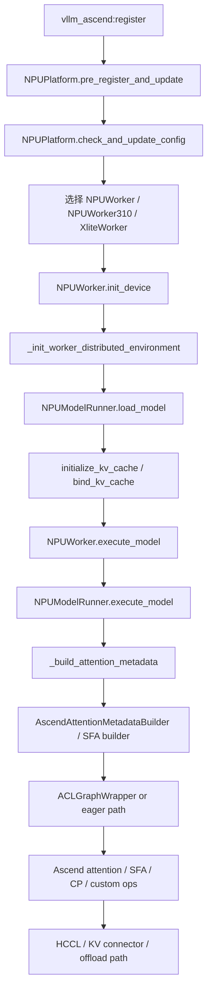

# vLLM-Ascend.md

## 1. 文档范围

- 分析对象：`vLLM/vllm-ascend`
- 本地源码基线：`d1f66849c9ea1459ca6a4c6c213ac3fec2ec1c9c`
- 对比基线：`vLLM/vllm-upstream` 本地 commit `92a7c121b62a1484b68c0a27d1ecefd1a84f78fc`
- 关注重点：Ascend/CANN/NPU 适配面、NPU worker/model runner、ACL graph、HCCL、KV pool、custom ops、量化与 310P 特化路径
- 重要边界：本地仓库没有显式声明“该插件对应哪一个官方 upstream commit 对”；本文以当前两个工作树的源码现状为准，不反推出官方配对关系
- 分析原则：优先看源码，设计文档仅作为补充印证

## 2. 核心结论

1. `vllm-ascend` 不是“把 CUDA 换成 torch_npu”这么简单，它在平台注册、配置规整、worker/runtime、attention metadata、图执行、通信、custom op 七个层面都做了系统性改写。
2. Ascend 适配最关键的系统差异不是某个算子，而是 runtime contract 改变了：`seq_lens_cpu`、graph param update、HCCL group 复用、KV 分裂与对齐都成为一等公民。
3. `NPUPlatform` 是整个适配层的总入口；它并不只负责设备枚举，而是重写 graph mode、worker class、量化模式、scheduler class、allocator 行为和 custom op 启用策略。
4. `NPUModelRunner` 延续了 upstream 的高层执行框架，但其内部已经深度 NPU 化：KV cache 拆分 K/V、2 MiB 对齐、PCP/DCP 兼容 block table、NPU graph 参数刷新、Ascend attention backend 选择。
5. Ascend 全图执行依赖的不只是 graph capture，还依赖后端 `update_graph_params()` 在 replay 前修正 attention 运行时参数；这与典型 CUDA graph 心智模型不同。
6. HCCL、KV transfer、CPU offload、Mooncake/UCM/AscendStore connector 构成了一个比 upstream 更重的“远端 KV/分布式缓存”层，这也是 Ascend 长上下文与解耦式部署的重要抓手。

## 3. 上游不变项与 Ascend 重写项

| 层级 | upstream 保留的核心不变量 | Ascend 重写点 |
|---|---|---|
| 引擎主循环 | 仍然是 `schedule -> execute_model -> update_from_output` | 通过 `NPUPlatform` 替换 worker、graph、compile、scheduler 默认行为 |
| 请求与调度抽象 | `Request`、`SchedulerOutput`、KV group 等抽象保留 | 加入 Ascend-specific scheduler、profiling chunk、recompute 策略 |
| KV 逻辑抽象 | 仍然按 block/group 管理 | 物理分配拆 K/V、对齐到大页、为 KV transfer/sparse/310P 增加额外张量 |
| Worker 模型 | 仍由 worker/model runner 翻译调度输出 | `NPUWorker`/`NPUModelRunner` 全量接管设备、图、metadata、spec decode 路径 |
| Attention 语义 | 仍然依赖 metadata builder + backend impl | builder 与 impl 都被 NPU 后端重写，并引入 `seq_lens_cpu`/graph param contract |
| 通信语义 | 仍有 TP/PP/DP/KV-transfer 语义 | NCCL 相关路径被 HCCL group、PyHccl、额外 MC2/flashcomm2/fine-grained TP 组扩展 |
| Native op 层 | 仍通过 Python wrapper -> native extension | 扩展为 ACLNN/AscendC/custom OPP 体系，而非 CUDA extension 体系 |

## 4. 适配面总览

| 适配面 | 关键路径 | 作用 |
|---|---|---|
| 平台插件入口 | `setup.py` `vllm_ascend/__init__.py` | 向 vLLM 注册 `ascend = vllm_ascend:register` |
| 平台总控 | `vllm_ascend/platform.py` | 设备平台定义、配置修正、worker 选择、graph/compile/custom op 策略 |
| Monkey patch | `vllm_ascend/patch/*` | 修补 upstream 中 CUDA/NCCL/布局/工具链假设 |
| NPU Worker/Runner | `vllm_ascend/worker/worker.py` `vllm_ascend/worker/model_runner_v1.py` | 接管设备初始化、执行主线、KV 分配、spec decode、graph replay |
| Attention 后端 | `vllm_ascend/attention/*` | AscendAttention、SFA、MLA、context parallel、KV 压缩稀疏等 |
| 通信层 | `vllm_ascend/distributed/*` | HCCL、额外 process group、KV transfer connectors |
| 编译与图 | `vllm_ascend/compilation/*` | ACL graph、AscendCompiler、FX fusion passes |
| 原生算子 | `vllm_ascend/ops/*` `csrc/*` | PrivateUse1 自定义 op、ACLNN/AscendC 内核 |
| 量化 | `vllm_ascend/quantization/*` `_310p/quantization/*` | ModelSlim、compressed tensors、310P 特化 W8A8 |

## 5. 端到端执行链路

## 6. 启动与配置规整

## 6.1 平台入口并不“轻”

`vllm_ascend/platform.py::NPUPlatform` 定义了：

- `device_name = "npu"`
- `dispatch_key = "PrivateUse1"`
- `simple_compile_backend = "eager"`
- `get_compile_backend() -> AscendCompiler`
- `get_pass_manager_cls() -> GraphFusionPassManager`

这意味着 Ascend 平台不是简单复用 upstream 的 compile 管线，而是明确声明：

- 通用 `torch.compile` 路径默认不可直接信任
- 图优化要经过自定义编译后端和自定义 pass manager

## 6.2 `pre_register_and_update()` 先打补丁，再谈设备

`NPUPlatform.pre_register_and_update()` 做了三件高优先级动作：

1. 调用 `adapt_patch(is_global_patch=True)` 安装全局 patch
2. 把 `ascend` 量化模式加入 CLI 选项
3. 根据芯片类型导入对应量化配置类

这说明 Ascend 适配的第一原则是：**先改 upstream 假设，再进入 worker 生命周期**。

## 6.3 `check_and_update_config()` 是真正的策略中心

`NPUPlatform.check_and_update_config()` 负责：

- auto detect quantization
- 初始化 `ascend_config`
- 修正 graph mode
- 处理 `xlite_graph_config`
- 在 `enforce_eager` 条件下禁用 compilation
- 重算 cudagraph/aclgraph capture sizes
- 选择 worker 类
- 启用 custom op
- 设置 Ascend scheduler class

这里最值得注意的是它把“平台能力约束”前置到配置层，而不是等到 runtime 报错再退化。

## 6.4 为什么 `import_kernels()` 不急着 import extension

`NPUPlatform.import_kernels()` 只设置 `ASCEND_CUSTOM_OPP_PATH`，而不是立刻 import `vllm_ascend_C`。
目的非常明确：避免过早触发 Ascend RTS 初始化，破坏 `ASCEND_RT_VISIBLE_DEVICES` 等设备可见性约束。

这与 CUDA 插件常见“import extension 即完成注册”的模式不同。

## 7. 深入拆解 A：NPU Worker 与 Model Runner

## 7.1 `NPUWorker` 负责设备与分布式初始化

`vllm_ascend/worker/worker.py::NPUWorker` 的职责包括：

- 安装 worker 级 patch
- 初始化 NPU device
- 初始化 HCCL/Gloo 双 process group
- 注册 dummy fusion op 和 Ascend custom op
- 估算可用显存
- 驱动 `NPUModelRunner`

它不是简单继承 `GPUWorker` 后改个 device type，而是把上游 worker 的若干关键假设全部替换掉。

## 7.2 `NPUModelRunner` 延续主干，但内部语义改变

`vllm_ascend/worker/model_runner_v1.py::NPUModelRunner` 仍继承自 upstream runner 体系，但新增了：

- PCP/DCP 相关布局管理
- Ascend sampler
- Ascend attention backend 选择
- `enable_enpu`
- `_needs_seq_lens_cpu_sync`
- spec decode/PCP 多模态适配
- ACL graph 参数更新时序控制

也就是说，**高层骨架保留，上下文协议重写**。

## 7.3 310P 是独立分支，不是 if-else 小补丁

仓库中存在单独的 `_310p` 目录：

- `_310p/attention/attention_v1.py`
- `_310p/attention/attention_mask.py`
- `_310p/quantization/methods/w8a8_static.py`
- `_310p/model_runner_310p.py`
- `_310p/worker_310p.py`

这表明 310P 与 910/A 系列并不是“同一 attention/backend 小改几行”能兼容的关系，而是独立 runtime 子路径。

## 8. 深入拆解 B：NPU 显存、KV Cache 与分配策略

## 8.1 显存 profiling 先排除 graph 池噪声

`NPUWorker.determine_available_memory()` 会显式使用 `torch.npu` 的 memory profiling，并在 graph capture 前做峰值快照。
目的是避免把图池占用错算成 activations，从而高估或低估可用于 KV 的空间。

这在 Ascend 下尤其重要，因为 graph/runtime buffer 的生命周期与 CUDA 并不完全等价。

## 8.2 默认 allocator 策略显式改写

`platform.py` 会在合适条件下注入：

`PYTORCH_NPU_ALLOC_CONF=expandable_segments:True`

这相当于告诉 NPU allocator：优先降低长期服务下的碎片化问题。
但如果启用 sleep mode，则会转向 `CaMemAllocator` 这类更强控制的路径，两者并不兼容。

## 8.3 `CaMemAllocator`：不是“把权重搬到 CPU”这么浅

`vllm_ascend/device_allocator/camem.py::CaMemAllocator` 提供：

- 可插拔 CANN allocator
- allocation tag
- sleep 时 unmap NPU memory
- 可选 pinned CPU backup

这说明 Ascend 的 sleep mode 是“显式控制设备内存映射/反映射”，而不仅是普通 offload。

## 8.4 KV cache 物理分配做了 NPU 特化

`NPUModelRunner._allocate_kv_cache_tensors()` 的关键差异：

- 把 K 和 V 分成独立 raw tensor，而不是简单复用 upstream 视图习惯
- 在 KV transfer / prefilling disaggregation 场景下做 2 MiB 对齐
- 兼容 hybrid attention、Mamba、MLA、sparse attention、sparse-C8 附加张量

这不是单纯“换一套 `get_kv_cache_shape()`”，而是围绕远端传输和 NPU 内存约束重写了分配策略。

## 8.5 `bind_kv_cache` 在 Ascend 是真实兼容性问题

`vllm_ascend/patch/__init__.py` 专门列出了对 `bind_kv_cache` 的 patch。
这说明 upstream 的 KV 绑定协议在 Ascend 上曾经不能直接复用，平台需要主动修正 layer -> KV tensor 的绑定方式。

## 8.6 CPU KV Pool 不是临时工具，而是二级缓存层

`vllm_ascend/distributed/kv_transfer/kv_pool/cpu_offload/cpu_kv_cache_manager.py` 显示 CPU offload 仍沿用 upstream 的 block/hash 思想：

- 复用 `BlockPool`
- 复用 single-type manager
- 维护 request -> computed blocks
- 记录 prefix cache 命中率
- 失败分配时回收 ahead touch

这意味着 Ascend 的 KV offload 并不是“裸 memcpy 到 CPU”，而是把 CPU 也纳入 page 化 KV 协议中。

## 9. 深入拆解 C：Attention Metadata、`seq_lens_cpu` 与图参数更新

## 9.1 这是 Ascend 最关键的 runtime contract

在 upstream CUDA 心智模型里，很多 attention 参数可以主要依赖 GPU 侧 metadata。
在 Ascend 中，`seq_lens_cpu` 与 `_seq_lens_cpu` 成为了明确协议，原因是：

- spec decode 会导致 optimistic 进度与真实接受 token 数短暂偏离
- graph replay 需要 host 侧在 replay 前刷新参数
- 某些 backend 直接消费 CPU 侧 seq lens 作为 runtime shape/source of truth

## 9.2 `NPUModelRunner` 明确维护 optimistic CPU 镜像

`model_runner_v1.py` 中存在：

- `self.optimistic_seq_lens_cpu`
- `self._needs_seq_lens_cpu_sync`
- `self._seq_lens_cpu_event`
- `self._seq_lens_cpu_event_pending`

其逻辑是：

1. 先乐观更新 CPU 侧 `seq_lens`
2. 如果 spec decode 回退导致真实接受 token 数变少，则异步把修正值拷回 CPU 镜像
3. 在 `_build_attention_metadata()` 读取前先 `synchronize()` 该 event

这是一条非常明确的 NPU 侧 host/device 协议链。

## 9.3 metadata builder 优先读取 `_seq_lens_cpu`

`vllm_ascend/attention/attention_v1.py::AscendAttentionMetadataBuilder.build()` 的读取优先级是：

1. `common_attn_metadata._seq_lens_cpu`
2. `common_attn_metadata.seq_lens_cpu`
3. `common_attn_metadata.seq_lens.to("cpu")`

`vllm_ascend/attention/sfa_v1.py` 也是同样逻辑。

这说明 `_seq_lens_cpu` 不是临时补丁字段，而是 **Ascend backend 明确依赖的稳定输入**。

## 9.4 ACL graph 不只 capture，还要 patch runtime params

`vllm_ascend/compilation/acl_graph.py` 的关键对象和函数：

- `ACLGraphWrapper`
- `GraphParams`
- `update_full_graph_params(...)`
- `update_graph_params_workspaces(...)`

`GraphParams` 会按 capture size 保存：

- `events`
- `workspaces`
- `handles`
- `attn_params`

然后在 replay 前调用 backend 的 `update_graph_params()` 刷新 attention runtime state。

这与“capture 一次，之后纯 replay”的粗糙理解不同。

## 9.5 `ACLGraphWrapper` 还主动插入 replay 屏障

`ACLGraphWrapper.__call__()` 在 replay 前会在必要时执行：

`torch.npu.current_stream().synchronize()`

原因写得非常直白：异步调度或多线程下，CPU 侧更新 attention params 的事件可能和前一轮 graph replay 交叉，导致 replay 读到错误元数据。

也就是说，Ascend 图执行的正确性依赖：

- host-side param update
- stream ordering
- replay barrier

## 9.6 并非所有 Ascend attention backend 都需要 graph param update

- `AscendAttentionBackendImpl.update_graph_params(...)` 明确实现了 paged attention 路径的更新逻辑。
- `AscendSFAImpl.update_graph_params(...)` 则直接是 no-op。

这说明不同 Ascend attention backend 的 graph compatibility contract 并不一致，不能一概而论。

## 10. 深入拆解 D：通信、HCCL 与分布式拓扑

## 10.1 HCCL 不是只通过 `torch.distributed` 间接使用

`vllm_ascend/distributed/device_communicators/pyhccl_wrapper.py` 用 `ctypes` 直接封装了：

- `HcclGetRootInfo`
- `HcclCommInitRootInfo`
- `HcclAllReduce`
- `HcclBroadcast`

这意味着某些低层 collectives 可以绕过高层 `torch.distributed` 包装，直接落到 HCCL C API。

## 10.2 上游 `GroupCoordinator` 被主动改写

`patch/worker/patch_distributed.py` 会：

- 建立 paired `hccl` device group 与 `gloo` CPU group
- 增加 `all_to_all`
- 接管 group 清理逻辑

这说明 Ascend 分布式适配不是简单设置 backend=`hccl`，而是要整体替换 process group 的构建与复用模型。

## 10.3 HCCL group 爆炸问题被显式处理

`patch/worker/_hccl_pg_registry.py` 做了 HCCL group registry 复用。
这很重要，因为 Ascend 侧还引入了更多组：

- `mc2`
- prefill-TP
- flashcomm2 组
- fine-grained TP 组
- shard weight 组
- dynamic EPLB 组

如果不复用，组数量和初始化成本都会失控。

## 10.4 KV transfer 在 Ascend 更重

`vllm_ascend/distributed/kv_transfer/__init__.py` 注册了多种 connector：

- `MultiConnector`
- Mooncake
- AscendStore
- UCM
- LMCache

`kv_pool/cpu_offload/` 下还单独实现了 CPU offload 子系统，但它不是在这里以独立 connector 名注册的。

这说明 Ascend 侧对远端 KV、P/D 解耦、CPU pool 的依赖更深，KV transfer 不只是一个可选扩展，而是重要体系能力。

## 11. 深入拆解 E：Custom Ops、Kernel 与编译路径

## 11.1 Python 侧 custom op 注册

`vllm_ascend/ops/register_custom_ops.py` 在 `PrivateUse1` dispatch key 上注册了一批 op。
它们覆盖：

- gather/pad/reduce
- prefetch
- quantize
- rope
- matmul + reduce

这一步的意义不是“方便 Python 调用”，而是让图编译/FX/fallback 路径都能看见可识别的 op 节点。

## 11.2 类级别 op 替换

`register_ascend_customop(...)` 会把 upstream `CustomOp` 名称映射到 Ascend 实现，例如：

- linear
- RMSNorm
- fused MoE
- MLA
- GDN
- rotary
- embedding

这意味着 Ascend 不是只在函数级替换 kernel，而是在 layer 实现层就完成 operator routing。

## 11.3 `ops/__init__.py` 里的 dummy op 很重要

在真正 extension ready 之前，仓库会先安装 dummy placeholder。
目的不是“凑合能跑”，而是保持 upstream 图构建和 pass 匹配流程继续工作，等真正 OPP/custom op 可用时再切换。

## 11.4 `csrc/` 是完整 ACLNN/AscendC 体系

从 `vllm-ascend/csrc/CMakeLists.txt` 可以看出，构建系统围绕 `op_host_aclnn*`、`opapi`、`opsproto`、`optiling` 以及 vendor package 安装规则组织 ACLNN / Ascend custom-op 产物，而不是 CUDA `.cu + torch binding` 的单一路径。

这意味着 Ascend 内核开发的重心在：

- ACLNN host stub
- tiling
- OPP packaging
- runtime registration

而不是 CUDA 世界里的 `.cu + torch binding` 这一套。

## 11.5 图优化有两层

第一层是 runtime graph：

- `ACLGraphWrapper`
- `torch.npu.NPUGraph`

第二层是 compile-time graph：

- `AscendCompiler`
- `GraphFusionPassManager`
- `torchair` / `npugraph_ex`

`GraphFusionPassManager` 中可见的 pass 类型包括：

- norm + quant
- qknorm + rope
- matmul + allreduce + RMSNorm
- muls + add
- sequence parallel passes

所以 Ascend 图优化不是单一 capture 技术，而是“FX 级融合 + runtime replay”的叠加体系。

## 11.6 310P 路径直接调用专用 NPU op

`_310p/attention/attention_v1.py` 中可以看到：

- `torch_npu._npu_paged_attention`
- `torch_npu._npu_flash_attention`
- `torch_npu._npu_paged_attention_splitfuse`

`_310p/attention/attention_mask.py` 还会把 mask 转成 `ACL_FORMAT_FRACTAL_NZ`。

这说明 310P 路径的 attention/operator contract 已经与通用 NPU 路径明显不同。

## 12. 性能模型与瓶颈对照

| 维度 | Ascend 特有瓶颈 | 代码策略 | 代价 |
|---|---|---|---|
| 设备初始化 | 过早导入 extension 会触发 RTS/init 问题 | `import_kernels()` 只设 OPP path，lazy load `vllm_ascend_C` | 初始化链更复杂 |
| 显存碎片 | 长期服务下 allocator 碎片与图池共存 | `expandable_segments` 或 `CaMemAllocator` | 路径分叉、sleep mode 限制 |
| KV 传输 | 远端 KV / PD 解耦要求对齐与分裂布局 | K/V split + 2 MiB 对齐 + connector 注册 | 分配逻辑更重 |
| 图执行 | graph 数量/stream 预算更紧 | `update_aclgraph_sizes()` 裁剪 capture sizes | 可覆盖形状范围缩小 |
| 图正确性 | replay 前 attention 参数需刷新 | `update_full_graph_params()` + barrier | host-side 同步开销 |
| 通信 | HCCL group 数量爆炸、组选项敏感 | registry 复用 + buffer size tuning | 维护复杂度上升 |
| 算子生态 | 不同芯片、不同模式下 op 支持不一致 | selective disable + 310P 分支 | 兼容矩阵变大 |
| 首次时延 | ATB/custom op 首次加载慢 | warmup matmul、dummy op、提前注册 | 启动路径更长 |

## 13. 证据与验证路径

源码之外，Ascend 仓库自身也保留了设计文档锚点，值得与代码交叉阅读：

- `docs/source/developer_guide/Design_Documents/ACL_Graph.md`
- `docs/source/developer_guide/Design_Documents/KV_Cache_Pool_Guide.md`
- `docs/source/developer_guide/Design_Documents/context_parallel.md`
- `docs/source/developer_guide/Design_Documents/npugraph_ex.md`
- `docs/source/developer_guide/Design_Documents/disaggregated_prefill.md`

验证目录主要集中在：

- `tests/ut/`
- `tests/e2e/`
- `benchmarks/`
- `docs/source/tutorials/features/`
- `docs/source/tutorials/hardwares/310p.md`

这些文档和测试的重要意义不是“替代源码”，而是帮助确认哪些路径是当前真的打算支持的。

## 14. 容易写错的点

- 不能把 `vllm-ascend` 描述成“只换后端 kernel”；平台、worker、patch、graph、通信都被改了。
- 不能把 ACL graph 理解成 CUDA graph 的直接等价物；它额外依赖 `update_graph_params()`。
- 不能忽略 `seq_lens_cpu` / `_seq_lens_cpu`；这是 Ascend metadata contract 的关键。
- 不能把 HCCL 仅视为 `torch.distributed backend=hccl`；仓库里有直接 `ctypes` HCCL 封装和 group registry。
- 不能把 CPU offload 理解成普通 tensor 搬运；它仍然维护 block/hash/prefix cache 语义。
- 不能假设所有 Ascend 芯片走同一路径；`_310p` 是单独子系统。
- 不能默认所有 compile/graph 特性同时启用；`npugraph_ex`、`xlite`、`flashcomm2`、dynamic EPLB、sparse-C8` 都会改变执行面。

## 15. 对 mini-vllm 的可迁移启示

1. 真正的异构后端适配，优先级应该是“协议兼容”而不是“算子替换”。
2. 如果未来要支持 NPU/其他加速器，最先抽象的应当是：
   - KV 物理布局接口
   - attention metadata builder
   - graph replay 参数更新接口
   - device communicator 接口
3. `seq_lens_cpu` 这个案例说明：当设备后端需要 host-side runtime 参数时，必须把 host/device 双视图做成正式协议，而不是临时 workaround。
4. patch 层不是耻辱层。对于快速跟进 upstream 的异构后端，平台 patch 往往是现实且必要的过渡手段。
5. 若要支持远端 KV/解耦式 prefill/decode，KV 管理器必须从一开始就允许：
   - block 对齐
   - 多级缓存
   - connector/外部命中
   - graph-aware 分配策略

## 16. 总结

从系统结构看，upstream vLLM 解决的是“如何把大模型推理组织成高吞吐的 token 调度与 page 化 KV 系统”；`vllm-ascend` 解决的是“如何在 Ascend 的运行时、图执行、通信、算子与内存约束下，把这套系统协议重新落到 NPU 上”。

因此，二者最本质的关系不是“主库 + 后端插件”，而是：

- upstream 定义了高层推理操作系统的抽象边界
- Ascend 分支证明了这些抽象边界里，哪些是稳定可复用的，哪些必须因硬件契约变化而重写

如果只看接口，`vllm-ascend` 像是一次后端适配；如果顺着源码走完整条链路，它更像是一次 **以保持上层控制流不变为目标、对底层执行契约进行系统重建的 NPU 移植工程**。
