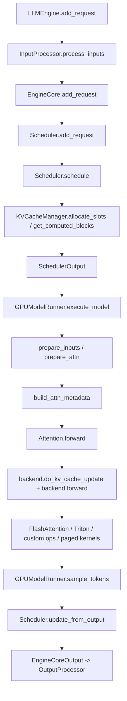

# vLLM.md

## 1. 文档范围

- 分析对象：`vLLM/vllm-upstream`
- 本地源码基线：`92a7c121b62a1484b68c0a27d1ecefd1a84f78fc`
- 关注重点：`vllm/v1` 调度执行主线、KV Cache/PagedAttention、continuous batching、Python 调度层到 C++/CUDA/后端 kernel 的落地链路
- 不展开的话题：OpenAI 兼容 API 表层协议、模型数学原理、单个模型结构细节
- 证据规则：所有关键结论都尽量落到具体源码路径、核心类、关键函数或执行链
- 分析维度：本文按四条硬件友好主线拆解
  1. 请求调度与批处理摊销
  2. KV Cache/显存组织
  3. attention/operator 执行路径
  4. 图执行与并行通信

## 2. 核心结论

1. vLLM 的“continuous batching”本质不是一个单独模块，而是 `Scheduler` 以 `num_computed_tokens` 追赶 `num_tokens_with_spec` 的统一调度模型。
2. PagedAttention 在系统层面的真正价值不是某一个 CUDA kernel，而是“逻辑块管理 + block table + slot mapping + backend-specific KV layout”构成的整套 KV 虚拟内存协议。
3. `Scheduler`、`KVCacheManager`、`GPUModelRunner` 三层分工非常清晰：前者决定“哪些 token 该算”，中间层决定“KV 放到哪里”，后者负责“把逻辑调度翻译成设备输入并执行”。
4. 在 v1 主线中，attention backend 已经从“单一 paged attention kernel”演进为“多后端可插拔执行系统”，FlashAttention、Triton、ROCm、自定义 kernel 都可能成为最终落点。
5. prefix cache 命中的最小单位是“完整 block”，而且即使命中全部前缀，最后一个 token 仍可能需要重算以产出 logits；这决定了它不是语义级“完全跳过 prompt”。
6. vLLM 的高吞吐来自三层摊销：调度摊销、元数据准备摊销、kernel/graph 执行摊销，而不是单点算子优化。

## 3. 系统边界与分层地图

| 层级 | 关键路径 | 主要职责 | 不负责 |
|---|---|---|---|
| Engine API 层 | `vllm/v1/engine/llm_engine.py` | 接收请求、输入标准化、输出后处理、驱动 `EngineCoreClient` | 不直接做调度和 kernel 执行 |
| Engine Core 层 | `vllm/v1/engine/core.py` | 初始化 executor、profiling 可用显存、创建 KV 配置、主循环 `schedule -> execute -> update` | 不关心具体 attention backend 细节 |
| 调度层 | `vllm/v1/core/sched/scheduler.py` | 运行队列/等待队列、token budget、preemption、spec decode、encoder budget、KV connector 协调 | 不直接分配底层张量 |
| KV 管理层 | `vllm/v1/core/kv_cache_manager.py` `vllm/v1/core/block_pool.py` `vllm/v1/core/kv_cache_coordinator.py` | block 分配、prefix cache 命中、block 生命周期、逻辑 KV 组协调 | 不执行模型前向 |
| Worker/Runner 层 | `vllm/v1/worker/gpu_worker.py` `vllm/v1/worker/gpu/model_runner.py` | 将 `SchedulerOutput` 翻译为设备输入，准备 block table/slot mapping/attention metadata，执行模型 | 不决定高层调度策略 |
| Attention Backend 层 | `vllm/v1/attention/*` `vllm/model_executor/layers/attention/attention.py` | 选择 backend，定义 KV 形状、stride、metadata builder、forward 逻辑 | 不管理请求级 block 生命周期 |
| Native Ops 层 | `vllm/_custom_ops.py` `csrc/attention/*.cu` | C++/CUDA/Triton/ROCm 自定义 kernel | 不理解请求队列语义 |

## 4. 端到端请求生命周期

### 4.1 入口与引擎主循环

- 入口对象是 `vllm/v1/engine/llm_engine.py` 中的 `LLMEngine`。
- `LLMEngine.add_request()` 先把原始 prompt、sampling params、LoRA、多模态输入等交给 `InputProcessor`，生成 `EngineCoreRequest`。
- `LLMEngine` 并不直接调度模型，而是通过 `EngineCoreClient.make_client()` 连接 `EngineCore`。
- 真正的内循环在 `vllm/v1/engine/core.py::EngineCore.step()`：
  1. `scheduler.schedule()`
  2. `model_executor.execute_model(...)`
  3. `scheduler.update_from_output(...)`

### 4.2 初始化阶段

`EngineCore.__init__()` 的关键动作：

1. 创建 `Executor`
2. 通过 `model_executor.get_kv_cache_specs()` 获取模型需要的 KV 规格
3. 用 `model_executor.determine_available_memory()` profiling 可用显存
4. 调用 `get_kv_cache_configs(...)` 生成 `KVCacheConfig`
5. `model_executor.initialize_from_config(...)` 真正分配 KV cache 并 warmup
6. 创建 `Scheduler`

这一点很关键：vLLM 的 KV 系统不是静态写死的，它是在模型加载后、显存 profiling 后、结合 backend 能力动态决定。

## 5. 核心状态对象与协议

| 对象 | 路径 | 所有者 | 作用 |
|---|---|---|---|
| `Request` | `vllm/v1/request.py` | Scheduler | 请求级状态机，记录 prompt/output/spec tokens、`num_computed_tokens`、`num_output_placeholders`、block hashes |
| `SchedulerOutput` | `vllm/v1/core/sched/output.py` | Scheduler | 一轮调度的设备侧执行描述，包括每个 request 计划计算的 token 数、block 变更、spec decode 元数据等 |
| `KVCacheConfig` | `vllm/v1/kv_cache_interface.py` | EngineCore / Worker | 描述 KV tensor、group、block size、layout 需求 |
| `KVCacheBlocks` | `vllm/v1/core/kv_cache_manager.py` | KVCacheManager | Scheduler 与 KV 管理层之间的抽象接口，隐藏内部 block 结构 |
| `InputBatch` | `vllm/v1/worker/gpu/input_batch.py` | GPUModelRunner | 一轮 batch 的扁平化设备输入描述，包括 `query_start_loc`、`seq_lens`、`input_ids`、`positions` |
| `CommonAttentionMetadata` | `vllm/v1/attention/backend.py` | Attention metadata builder | backend 无关的 attention 输入协议 |
| `slot_mapping` | `vllm/v1/worker/gpu/block_table.py` | Worker | 逻辑 token 位置到物理 KV 槽位的映射 |
| `block_tables` | `vllm/v1/worker/gpu/block_table.py` | Worker | 请求视角的“逻辑序列 -> 物理 block 列表”映射 |

### 5.1 `Request` 为什么是 continuous batching 的核心

`vllm/v1/request.py::Request` 中最关键的三个字段：

- `num_computed_tokens`
- `num_tokens_with_spec`
- `num_output_placeholders`

这三个字段决定了一轮调度还需要为该请求推进多少 token。`Scheduler.schedule()` 的核心不是“这个请求处于 prefill 还是 decode”，而是“这个请求还差多少 token 没被计算”。

## 6. 系统不变量

### 不变量 1：调度推进以 token 差值为中心，而不是以阶段名为中心

在 `vllm/v1/core/sched/scheduler.py::Scheduler.schedule()` 中，作者直接写明：

- 没有严格意义上的 “prefill phase” 和 “decode phase”
- 调度器只关心让 `num_computed_tokens` 追上 `num_tokens_with_spec`

因此，chunked prefill、spec decode、prefix cache、future jump decoding 都能统一进一个框架。

### 不变量 2：KV 的逻辑抽象是 block，物理布局交给 backend

- Scheduler/KV manager 只处理 block id 和 block 数量。
- 物理 KV tensor 的 shape、stride、layout 由 backend 在 `vllm/v1/worker/gpu/attn_utils.py::_reshape_kv_cache()` 中决定。
- 同一个高层调度逻辑可以落在不同 KV 物理布局上。

### 不变量 3：prefix cache 只缓存完整 block，而且最后一个 token 可能必须重算

`vllm/v1/core/kv_cache_manager.py::get_computed_blocks()` 中，命中的 prefix 以完整 block 为单位统计。
即使所有 prompt token 都命中，也会把 `max_cache_hit_length` 设成 `request.num_tokens - 1`，避免最后一个 token 完全不经过前向，从而拿不到 logits。

### 不变量 4：preemption 是真实回退，不是“暂停后原地恢复”

在 `Scheduler._preempt_request()` 中，请求会：

- 释放 KV blocks
- 释放 encoder cache
- 重置局部进度
- 重新回到 waiting 队列

因此 preemption 的代价很高，系统依赖 admission 和 token budget 降低抖动。

### 不变量 5：PagedAttention 是“系统协议”，不是“单 kernel 名称”

`vllm/v1/attention/ops/paged_attn.py::PagedAttention` 只提供 `split_kv_cache()` 和 `write_to_paged_cache()` 这样的工具函数。
真正的 decode/prefill 执行路径可能落到：

- `FlashAttention`
- `Triton`
- `ROCm custom paged attention`
- `_C.paged_attention_v1/v2`

所以 “用了 PagedAttention” 在 v1 里更准确地说是“用了 page-based KV 管理协议”。

## 7. 深入拆解 A：调度器与 Continuous Batching

## 7.1 调度预算

`Scheduler` 初始化时最关键的预算字段：

- `max_num_running_reqs = max_num_seqs`
- `max_num_scheduled_tokens`
- `max_model_len`
- `encoder_compute_budget`
- `num_lookahead_tokens`（spec decode）

这一组预算共同决定“一轮能推进多少请求、多少 token、多少 encoder work”。

## 7.2 运行中请求优先，等待中请求后补

`Scheduler.schedule()` 的基本顺序：

1. 先调度 `running`
2. 再调度 `waiting`
3. 若 block 不够则 preempt 低优先级 request
4. 最终形成 `SchedulerOutput`

这样做的直接效果是：

- decode 请求可以持续推进，避免短请求被长 prompt 完全压住
- chunked prefill 可以与 decode 混排
- request 的“热状态”尽量保留在 worker 常驻内存中

## 7.3 `num_new_tokens` 的统一定义

对于 running request，调度器的核心式子是：

`num_new_tokens = num_tokens_with_spec + num_output_placeholders - num_computed_tokens`

这正是 continuous batching 的本体：请求不是被分成 prefill/decode 两个静态阶段，而是被看作一个不断追赶“应有计算进度”的 token 流。

## 7.4 长 prompt 与 chunked prefill

如果 `long_prefill_token_threshold` 被设置，长 prompt 会被主动切块。
若 `enable_chunked_prefill` 为假，等待队列中的长 request 在 token budget 不足时会直接停住，而不是被部分推进。

这意味着：

- chunked prefill 是吞吐优化
- 但它也带来 admission 复杂度和 KV churn 风险

## 7.5 admission 保护

`Scheduler` 还可以在 `scheduler_reserve_full_isl` 打开时调用 `KVCacheManager.can_fit_full_sequence()`。
这不是普通“当前 chunk 能不能塞下”，而是“整条序列最终能不能放得下”。

它的意义是防止 chunked prefill 只看眼前可行、后续反复 preempt/recompute。

## 7.6 spec decode 与 structured output 不是外挂

在 v1 中，spec decode、grammar bitmask、async scheduling 都直接嵌进主热路径：

- `EngineCore.step_with_batch_queue()`
- `GPUModelRunner.sample_tokens()`
- `Scheduler.update_draft_token_ids(...)`
- `Scheduler.get_grammar_bitmask(...)`

所以它们不是“旁路特性”，而是吞吐模型的一部分。

## 8. 深入拆解 B：KV Cache、Block Pool 与 PagedAttention

## 8.1 Block Pool：全局物理资源池

`vllm/v1/core/block_pool.py::BlockPool` 负责：

- 初始化所有 `KVCacheBlock`
- 维护 free block queue
- 维护 block hash -> cached block 的映射
- 负责 eviction / touch / free

从系统视角看，它相当于“KV 页框分配器”。

## 8.2 `KVCacheManager`：请求视角的逻辑 KV 管理器

`KVCacheManager` 封装了几类关键操作：

- `get_computed_blocks(request)`：查 prefix cache 命中
- `can_fit_full_sequence(...)`：admission 检查
- `allocate_slots(...)`：给本轮新 token 分配 block
- `usage`：汇报 KV 使用率

其中 `allocate_slots()` 的注释本身已经给出了非常清晰的布局语义：

- 已计算的本地 token
- 新命中的 prefix token
- connector 中外部已有 token
- 本轮新算 token
- speculative lookahead token

vLLM 真正难的地方就在这里：它不是简单地“追加新 token”，而是在一个混合缓存状态上做 block 级资源调度。

## 8.3 prefix cache 命中为何是 block 级

block hash 的生成与请求状态绑定在 `Request.update_block_hashes()`。
命中查找由 `KVCacheCoordinator.find_longest_cache_hit(...)` 完成。

这带来三个直接后果：

1. 命中的最小单位是完整 block
2. block 对齐会影响是否能完全复用
3. 某些 backend 或 cache mode 会要求更严格的对齐策略

## 8.4 逻辑 block 与物理 KV tensor 布局严格分离

在 `vllm/v1/worker/gpu/attn_utils.py` 中：

- `_allocate_kv_cache()` 先按字节分配原始张量
- `_reshape_kv_cache()` 再根据 backend 的 `get_kv_cache_shape()` 和 `get_kv_cache_stride_order()` 把原始张量重解释为 backend 需要的布局
- `build_slot_mappings_by_layer()` 再把逻辑 slot mapping 绑定到具体 layer

这意味着 scheduler 只知道 `block_size`，并不知道底层 `kv_cache` 是 `NHD` 还是 `HND`、是 fused K/V 还是 split K/V。

## 8.5 `block_table` 与 `slot_mapping` 是系统协议的桥

Worker 侧 `vllm/v1/worker/gpu/block_table.py` 做两件事：

- `gather_block_tables()`：把请求已拥有的 block id 拉平成 batch 视角表
- `compute_slot_mappings()`：把 token 在逻辑序列中的位置映射到物理 KV 槽位

没有这一步，调度器的“逻辑 block 列表”无法变成 kernel 可消费的物理地址。

## 8.6 native paged attention kernel 在哪里

典型 wrapper 在 `vllm/_custom_ops.py`：

- `paged_attention_v1(...)`
- `paged_attention_v2(...)`

底层 CUDA 实现位于：

- `csrc/attention/paged_attention_v1.cu`
- `csrc/attention/paged_attention_v2.cu`

但在 v1 主线里，很多实际路径已经通过 `FlashAttention` 或 `Triton` backend 实现统一 attention，所以不能把整个系统简化为“直接调用 paged_attention_v2”。

## 9. 深入拆解 C：从调度输出到设备执行

## 9.1 `GPUModelRunner.execute_model()` 是翻译层核心

`vllm/v1/worker/gpu/model_runner.py::GPUModelRunner.execute_model()` 的关键步骤：

1. 清理已结束请求状态
2. 合并/更新 batch 内常驻 request state
3. `prepare_inputs(...)`
4. `prepare_attn(...)`
5. 构建 `attn_metadata`
6. 决定走 CUDA graph replay 还是 eager/model forward
7. `sample_tokens(...)`

它本质上是“把请求级状态机翻译为单轮设备执行描述”。

## 9.2 `InputBatch`：扁平化 batch 协议

`vllm/v1/worker/gpu/input_batch.py::InputBatch` 包含：

- `query_start_loc`
- `seq_lens`
- `seq_lens_cpu_upper_bound`
- `input_ids`
- `positions`
- `logits_indices`
- `cu_num_logits`

这些字段共同描述了一轮混合 prefill/decode batch 的扁平表示。

特别重要的是：

- `prepare_prefill_inputs(...)` 用 Triton kernel 从 request state 中抽取 prompt token
- `prepare_pos_seq_lens(...)` 计算 `positions` 和 `seq_lens`

这两步都是为了避免 Python 逐 token 处理带来的 CPU 开销。

## 9.3 attention metadata builder 是后端桥梁

`vllm/v1/worker/gpu/attn_utils.py::build_attn_metadata(...)` 会把：

- `query_start_loc`
- `seq_lens`
- `block_tables`
- `slot_mappings`
- `positions`

转换成 backend-specific metadata。

这意味着 backend 的切换点并不在高层调度器，而在 worker 侧 metadata builder。

## 9.4 Layer 级 attention 不是直接读 scheduler

`vllm/model_executor/layers/attention/attention.py::Attention.forward()` 并不理解 request queue。
它通过 forward context 拿到当前 layer 对应的：

- attention metadata
- slot mapping
- KV cache view

然后执行：

- `unified_kv_cache_update`
- `unified_attention_with_output`

这保证了 layer 层只关心“本层本轮该如何更新 KV、如何做 attention”，不关心上层调度。

## 9.5 graph 与 eager 只是执行外壳不同

在 `GPUModelRunner.execute_model()` 中：

- 若 `batch_desc.cg_mode == FULL`，走 CUDA graph replay
- 否则走 eager / piecewise compiled path

但无论哪种模式，输入协议本身都一样：都依赖 `InputBatch + block_tables + slot_mappings + attn_metadata`。

## 10. 性能模型

| 维度 | 关键机制 | 代码锚点 | 主要收益 | 主要代价 |
|---|---|---|---|---|
| 显存/KV 驻留 | BlockPool + prefix cache + page 化 KV | `block_pool.py` `kv_cache_manager.py` | 提升并发、减少重复 prefill | 对齐、hash、eviction 复杂 |
| Host 端摊销 | Triton metadata prep kernels | `gpu/input_batch.py` `gpu/block_table.py` | 降低 Python 逐 token 开销 | 维护 CPU/GPU 双视图复杂 |
| 算子效率 | FlashAttention/Triton/custom ops | `v1/attention/backends/*` | 提升 kernel 吞吐 | backend 分叉、layout 差异 |
| 图执行 | CUDAGraph replay | `gpu/model_runner.py` | 降低 launch overhead | shape 受限、warmup 成本 |
| 并行通信 | DP/PP/DCP + KV connector | `gpu_worker.py` `distributed/kv_transfer/*` | 扩大吞吐/上下文长度 | 协调复杂、回退路径多 |
| Admission 策略 | full-sequence reserve / preemption | `scheduler.py` | 减少抖动与重算 | 保守策略会牺牲利用率 |

## 11. 测试与证据地图

源码外的验证证据主要集中在：

- `tests/v1/core/`：Scheduler、KV、请求状态机
- `tests/v1/`：worker/spec decode/KV connector
- `tests/distributed/`：context parallel、并行路径
- `docs/` 和 upstream design notes：概念性说明

阅读顺序建议是先代码后测试：

1. `vllm/v1/engine/core.py`
2. `vllm/v1/core/sched/scheduler.py`
3. `vllm/v1/core/kv_cache_manager.py`
4. `vllm/v1/worker/gpu/model_runner.py`
5. `vllm/v1/worker/gpu/attn_utils.py`
6. `tests/v1/core/*`

## 12. 容易误解的点

- `continuous batching` 不是“多个请求拼成 batch”这么简单，而是请求进度状态机在多轮迭代中的持续重排。
- `PagedAttention` 不是“一个 kernel 名”，而是整个 page 化 KV 协议。
- prefix cache 不是“命中就完全不算”。
- `prefill`/`decode` 在 attention backend 和 runtime shape 上有意义，但在调度器内部不是两套独立算法。
- 不能假定所有 backend 的 KV layout 一样；这是 backend 自由度的一部分。
- 不能假定所有环境都走同一个 runner；`VLLM_USE_V2_MODEL_RUNNER` 会改变执行主线。

## 13. 对 mini-vllm 的可迁移启示

1. 如果要保留教学友好性，最值得先学的是 `Request` 的状态变量设计，而不是先复刻复杂 kernel。
2. 只要想做真正的 continuous batching，就必须显式建模 `num_computed_tokens`，而不是只维护“当前生成到第几步”。
3. KV 系统最好分成三层：
   - 请求逻辑层
   - block 资源层
   - backend 物理布局层
4. block table 和 slot mapping 必须是显式协议对象；否则调度器和 kernel 层会强耦合。
5. prefix cache 的真实复杂度在“对齐、block 命中、最后一 token 重算”，这些边界比 cache hit rate 本身更重要。
